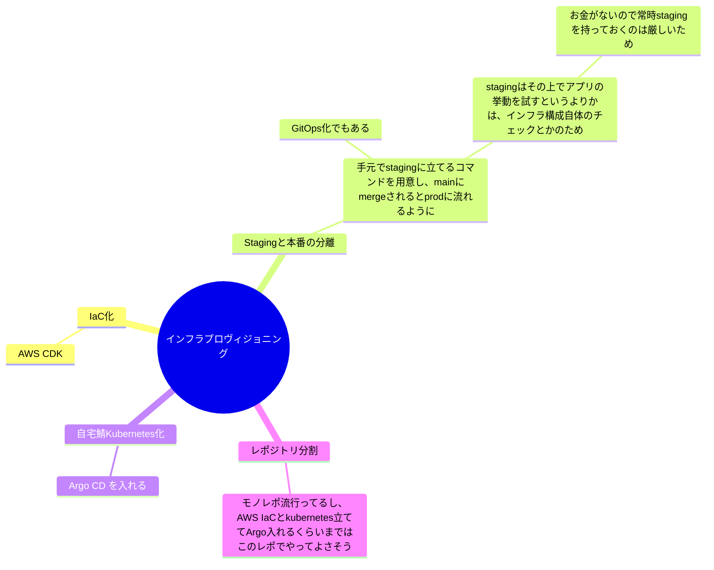

# roadmap

```mermaid
mindmap
    root((インフラプロヴィジョニング))
        IaC化
            AWS CDK
        Stagingと本番の分離
            手元でstagingに立てるコマンドを用意し、mainにmergeされるとprodに流れるように
                GitOps化でもある
                stagingはその上でアプリの挙動を試すというよりかは、インフラ構成自体のチェックとかのため
                    お金がないので常時stagingを持っておくのは厳しいため
        自宅鯖Kubernetes化
            Argo CD を入れる
        レポジトリ分割
            モノレポ流行ってるし、AWS IaCとkubernetes立ててArgo入れるくらいまではこのレポでやってよさそう

```
